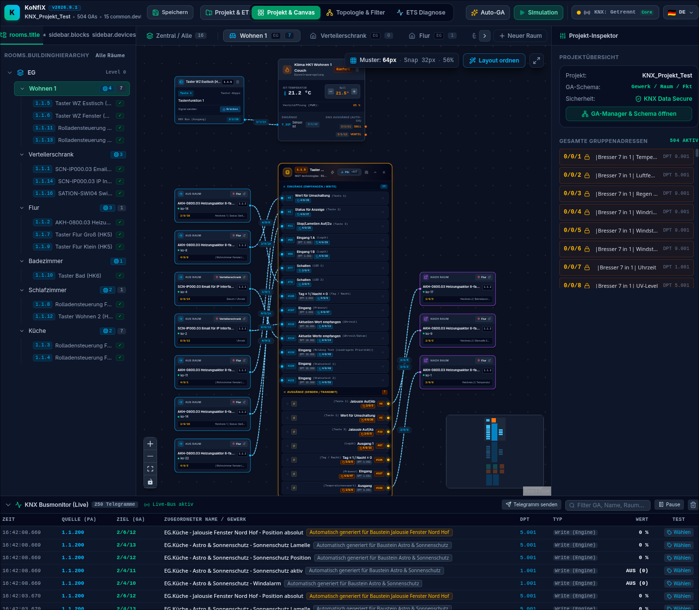
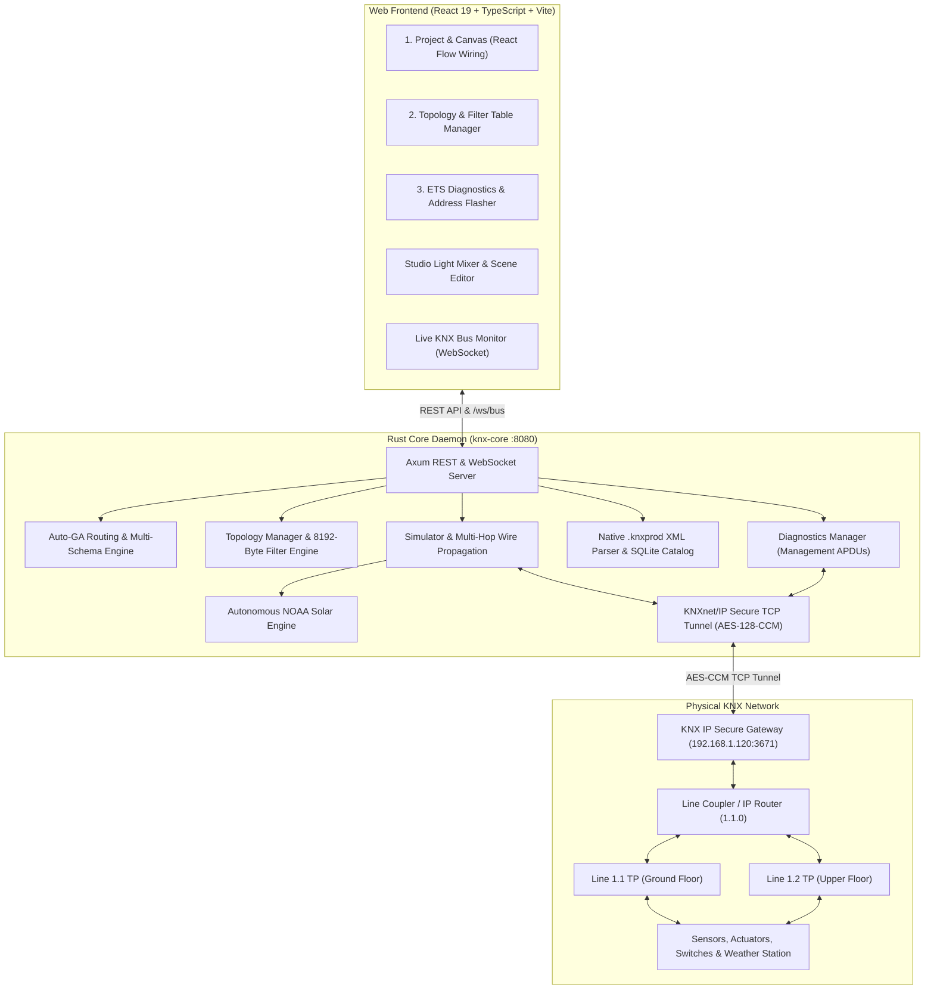
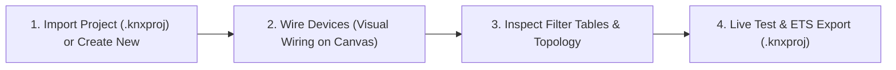

# KoNfiX — The Visual KNX Configurator

[](https://www.rust-lang.org/)
[](https://react.dev/)
[](https://www.typescriptlang.org/)
[](https://vitejs.dev/)
[-green.svg)](https://www.knx.org/)
[-emerald.svg)](https://www.knx.org/)
[](https://github.com/)
[](LICENSE)

A modern, cross-platform, open-source alternative to classical ETS (Engineering Tool Software).

**KoNfiX** combines the uncompromised reliability and interoperability of the worldwide **KNX industry standard** with an intuitive visual function block architecture and native filesystem persistence in `~/.konfix/`. Instead of manually entering thousands of group addresses into abstract tabular matrices, you wire your installation visually with **intelligent function blocks**, utilize a **studio lighting console**, enjoy **autonomous astro solar tracking**, manage your installation with a comprehensive **topology & filter table manager**, leverage a **differential flashing engine with KNX Data Secure**, and communicate directly via **KNX IP Secure live bus connection**.

<p align="center">
  
</p>

> **Visual Blueprint Canvas in Action:** Direct hardware KO wiring (e.g. MDT Glass Push Button II), climate controllers, inter-room signal portals (`AUS RAUM` / `NACH RAUM` with 1-click jump navigation), 24/7 real-time bus monitor with live cEMI telegram decoding, and instant workspace switching (*Project & Canvas*, *Topology & Filter*, *ETS Diagnostics*).

---

## Table of Contents

- [The Three Primary Workspaces](#the-three-primary-workspaces)
  - [1. Project & Canvas (Visual Logic & Blueprint Wiring)](#1-project--canvas-visual-logic--blueprint-wiring)
  - [2. Topology & Filters (Areas, Lines & 8192-Byte Filter Tables)](#2-topology--filters-areas-lines--8192-byte-filter-tables)
  - [3. ETS Diagnostics & Addressing (Line Scanner & Flasher)](#3-ets-diagnostics--addressing-line-scanner--flasher)
- [Project Management, Filesystem & Storage (~/.konfix)](#project-management-filesystem--storage-konfix)
- [Additional Core Features](#additional-core-features)
  - [Differential Programming Engine & KNX Data Secure (TP)](#differential-programming-engine--knx-data-secure-tp)
  - [Parameter Memory Mapping & LoadedImage Patching](#parameter-memory-mapping--loadedimage-patching)
  - [KNX Datapoint Type (DPT) Registry & Input Validation](#knx-datapoint-type-dpt-registry--input-validation)
  - [KoNfiX KNX Sniffer & Transparent Proxy (knx_sniffer)](#konfix-knx-sniffer--transparent-proxy-knx_sniffer)
  - [Visual Wiring (Blueprint Approach for Hardware Devices)](#visual-wiring-blueprint-approach-for-hardware-devices)
  - [Native .knxprod Catalog & Parameter Manager](#native-knxprod-catalog--parameter-manager)
  - [Autonomous NOAA Astro Engine & Weather Station](#autonomous-noaa-astro-engine--weather-station)
  - [Studio Lighting Console & DPT 18.001 Scenes](#studio-lighting-console--dpt-18001-scenes)
  - [Complete .knxproj Roundtrip Export (ETS 5 & ETS 6.2 Schema 23)](#complete-knxproj-roundtrip-export-ets-5--ets-62-schema-23)
  - [KNX IP Secure Live Gateway & Session Management](#knx-ip-secure-live-gateway--session-management)
  - [Model Context Protocol (MCP) & AI Integration](#model-context-protocol-mcp--ai-integration)
- [System Architecture](#system-architecture)
- [Quickstart Guide](#quickstart-guide)
- [Development Mode & Testing](#development-mode--testing)
- [Project Structure](#project-structure)
- [Documentation & License](#documentation--license)

---

## The Three Primary Workspaces

The header features a clean, modern three-zone layout (Left: Branding, key metrics, quick-save & central "Project & ETS" menu; Center: Centered workspace switcher; Right: Contextual tools, language switcher & combined Gateway/Core status):

```
┌────────────────────────────────────────────────────────────────────────────────────────────────────────┐
│ [K] KoNfiX (KNX)                │ [ Project & Canvas │ Topology │ Diagnostics ] │ [⚡ Auto-GA] [▶ Sim]   │
│     Residential • 436 GAs       │                                               │ [🇬🇧 EN ▾]             │
│     [💾 Save] [Project & ETS ▾] │                                               │ [● KNX: 192.168.1.50] │
└────────────────────────────────────────────────────────────────────────────────────────────────────────┘
```

---

### 1. Project & Canvas (Visual Logic & Blueprint Wiring)
* **Visual Function Blocks (React Flow):**
  * *Lighting Control:* Dimmers, switches, staircase timers, master-off.
  * *Automatic Blinds / Shutters:* Travel time calibration, slat positioning, solar elevation tracking.
  * *Astro Solar Shading:* Autonomous facade shading tracking sun azimuth & elevation without cloud dependence.
  * *Light Scenes:* 8 ambient moods per room with DPT 18.001 multi-signal distribution.
  * *Universal Logic Gates:* AND, OR, XOR, NOT, NAND, NOR, RS-Flip-Flop with live status LEDs.
  * *Weekly Timers:* Schedules for Mon–Sun with minute precision.
  * *Threshold Switches:* Configurable switching hysteresis for illuminance, wind, or temperature.
* **Blueprint Hardware Blocks (`KnxDeviceBlockNode`):**
  * Place physical KNX devices (e.g. MDT Glass Push Button, Dimming Actuator) directly onto the canvas.
  * Every communication object (KO) appears as an interactive pin (Inputs / Outputs).
  * Draw a wire from a push button pin to an actuator pin — the system automatically generates and assigns the proper group address in the background!
* **Room Portals for Cross-Room Connections (`RoomPortalNode`):**
  * Connections across room boundaries (e.g., push button in living room controls dimmer in distribution board, or outdoor weather station broadcasts to bedroom blinds) are represented on both canvases as elegant **Portal Pills**.
  * Displays target room badge (e.g. `📍 Distribution Cabinet`), device name, channel label, and group address.
  * **Interactive Jump Navigation:** Clicking the jump button instantly switches the room tab to the destination room and highlights the connected device!
* **Intelligent Signal Flow Auto-Layout:**
  * **Row Alignment (Swimlanes):** Connected partners (Inputs/Sensors left ➔ Function blocks center ➔ Actuators/Portals right) sit precisely on the same horizontal row.
  * **Crossing-Free Wires:** Connections run straight horizontally from left to right instead of diagonal wire tangles.
  * **Organized Staging Area:** Unconnected devices or blocks are neatly stacked in a clean grid below the active signal chains.
* **Room & Floor Navigation:** Floor navigation (Ground Floor, Upper Floor, Basement, Outdoor) with cleanly separated working areas.

---

### 2. Topology & Filters (Areas, Lines & 8192-Byte Filter Tables)
* **Hierarchical KNX Topology:**
  * Management of areas (0..15) and lines (x.0..x.15).
  * Support for multiple transmission media: **TP** (Twisted Pair), **IP** (KNXnet/IP Routing), **RF** (Radio Frequency).
  * Automatic detection and reconstruction of line topology during `.knxproj` imports.
* **Deterministic 8192-Byte Filter Table Calculation:**
  * Line couplers and IP routers isolate sublines from the main line to prevent bus overload.
  * The engine analyzes the visual canvas wiring and project group addresses automatically:
    * **Forward (`Bit = 1`):** When a group address is required both on the subline and externally (on other lines or consumed by 24/7 server canvas blocks).
    * **Filter / Block (`Bit = 0`):** Purely line-internal telegrams are filtered at the coupler boundary, reducing main line bus load by up to 95%.
* **Selectable Coupler Modes:**
  * *Filter (Normal):* Fully automatic protection mode according to calculated filter table.
  * *Route / Forward (Diagnostics):* All telegrams pass unfiltered (ideal for commissioning and troubleshooting).
  * *Block:* All inter-line traffic is completely blocked at the coupler.
* **Manual Overrides & Hardware Export:**
  * 1-click manual bypass per group address.
  * **`.bin` Export:** Download the real 8192-byte binary file (65,536 bits representing $0/0/0$ to $31/7/255$) ready for line coupler programming.
* **Device Migration:**
  * Move physical devices to a different line with a single click.
  * The system automatically allocates the next free physical address on the destination line (e.g., `1.2.1`).

---

### 3. ETS Diagnostics & Addressing (Line Scanner & Flasher)
* **255-Address Matrix (16x16 Line Scan):**
  * Fast line scan of all physical addresses on a line (e.g. `1.1.1` to `1.1.255`).
  * Color-coded states: *Occupied* (green), *Free* (dark grey), *Programming Mode* (pulsing red).
  * Measures round-trip time (RTT in ms), mask version, and manufacturer ID.
* **Programming Mode Scanner:**
  * Instantly detects any device on the network whose physical programming button has been pressed (`A_IndividualAddress_Read` broadcast).
* **Integrated Physical Address Flasher:**
  * Program physical addresses directly from the web interface (`A_IndividualAddress_Write`) — without requiring an expensive ETS license.

---

## Project Management, Filesystem & Storage (~/.konfix)

KoNfiX features a native, structured filesystem storage engine and operates completely independent of cloud services.

### Default Directory Structure
By default, all project data is managed locally in the user's home directory under `~/.konfix/`:
```
~/.konfix/
├── projects/              # Complete KNX project files (*.konfix)
│   └── Residential.konfix
├── views/                 # Saved UI view states (*.view.json)
│   └── Residential.view.json
├── catalog.db             # High-performance SQLite hardware catalog
├── backups/               # Automated backups before schema changes
└── settings.json          # Global path and auto-save configuration
```

### Project Actions & Menu
* **Quick Save (`Ctrl + S` / `Cmd + S`):**
  * Dedicated button in the header or standard keyboard shortcut.
  * Writes the current project status deterministically and atomically to `~/.konfix/projects/<ProjectName>.konfix`.
  * Displays the last saved timestamp in the header with animated success feedback.
* **Open & Switch Projects (`OpenProjectModal`):**
  * Overview of all available `.konfix` projects with rich metadata (device count, group addresses, file size, modification date).
  * 1-click project switching without restarting the backend daemon.
  * Create new projects from scratch or templates.
* **Storage Directory & Settings (`StorageSettingsModal`):**
  * The storage location can be customized at runtime (e.g., pointing to a Nextcloud folder, Git repo, or network NAS share).
  * Optional 1-click migration moving all existing projects and catalogs to the new target folder.
  * Toggle continuous **Auto-Save** on canvas modifications.
* **Persistent View State (`views/`):**
  * Restores your exact workspace (*Canvas*, *Topology*, or *Diagnostics*) and last active room tab when reopening a project.

---

## Additional Core Features

### Differential Programming Engine & KNX Data Secure (TP)
* **Smart Flashing (Partial Flashing):**
  * Instead of re-transmitting all parameters and address tables upon every small modification, the engine retains an exact snapshot (`DeviceFlashedSnapshot`).
  * Differential dirty detection compares GAs, KO associations, and parameter blocks, transferring only the modified memory bytes (`A_GroupAddressTable_Write`, `A_AssociationTable_Write`, `A_Memory_Write`).
  * Result: Device programming finishes in 1–2 seconds instead of slow ETS transfer cycles!
* **KNX Data Secure on Twisted Pair (TP):**
  * Full implementation of the official field-level security standard (AN159 / ISO 22510).
  * Direct entry of the device **FDSK** (Factory Default Setup Key) with automatic hex/dash format validation.
  * Autonomous generation of cryptographic **Tool Keys** (16 bytes / AES-128).
  * **AES-128-CCM Authenticated Encryption** with 4-byte MAC and 48-bit monotonic sequence counter for replay protection.
* **Asynchronous Tokio Job Queue & Live Drawer:**
  * Sequential queue execution (KNX TP allows only one active point-to-point management session at a time).
  * Floating progress drawer with step-by-step verification, live terminal log, and retry logic.
  * Supported job types:
    * `Partial` (Smart Flash: writes only changed GAs & parameters)
    * `Full` (Complete reprogramming of all tables & memory)
    * `PhysicalAddress` (Programs physical individual address into device)
    * `FilterTable` (Flashes 8192-byte filter table into coupler)
    * `Restart` (Sends `A_Restart` telegram)

### Parameter Memory Mapping & LoadedImage Patching
* **Bit-Accurate Memory Offsets:**
  * Parameters are mapped with exact byte offsets, bit offsets (0..7, where bit 0 is MSB `0x80` as defined in KNX XML Schema 23), and bit widths.
  * Dynamically evaluates parent `<Union>` offsets and standalone memory segments from ETS project files and `.knxprod` catalogs.
* **Authentic `LoadedImage` Reverse-Engineering & Patching:**
  * Decompresses the device's raw-deflate base64 ETS memory image (`LoadedImage`).
  * Locates application parameter segment (Segment 4 / LoadStateMachine 4) via dynamic header detection.
  * Directly patches modified parameter bytes at their exact relative segment offsets (e.g. 28s UP / 26s DOWN shutter travel times at offsets 4 and 6 in MDT AKU-B2UP.03).
  * Automatically recompresses for 100% ETS-compatible roundtrips and differential hardware flashing.
* **UI Memory Badges & Dirty-State Indicators:**
  * The parameter inspector and modal table display memory address badges (e.g. `0x0004 [16 Bit]`).
  * Changed parameters are visually highlighted with modified status chips.

### KNX Datapoint Type (DPT) Registry & Input Validation
* **Full DPT Coverage (KNX Standard 03/07/02):**
  * Centralized DPT registry spanning DPT 1 (boolean switch), DPT 2 (forced control), DPT 3 (dimming/blinds), DPT 5 (8-bit scaling/percent), DPT 6 (8-bit signed), DPT 7 (16-bit unsigned integer), DPT 8 (16-bit signed), DPT 9 (16-bit 2-byte float), DPT 10/11 (time/date), DPT 12/13 (32-bit counter/energy), DPT 14 (32-bit IEEE float), DPT 18 (scene control), and DPT 232 (RGB).
* **Strict Integer & Value Range Protection (`ParameterInputField`):**
  * Prevents input of invalid decimal points (`.` and `,`) or scientific notation (`e`/`E`) on integer-only datapoint types (e.g. DPT 7.005 travel times in seconds).
  * Enforces `min`, `max`, and `step` boundaries with visual warning feedback and arrow key steppers.
* **Interactive Tooltips & Live Bus Monitor Formatting:**
  * Communication object tables show interactive DPT badges with data type, engineering units, and format tooltips (`[Integer]` vs `[Float]`).

### KoNfiX KNX Sniffer & Transparent Proxy (knx_sniffer)
A dedicated, standalone CLI diagnostic utility and transparent proxy ([`crates/knx-core/src/bin/knx_sniffer.rs`](crates/knx-core/src/bin/knx_sniffer.rs)):
* **Autonomous Live Bus Monitoring:**
  * Connects over KNXnet/IP Secure (Diffie-Hellman + AES-128-CCM) directly to any target KNX gateway.
  * Real-time color-coded terminal monitor decoding source IA, destination GA/IA, TPCI, APCI (GroupValue_Write, PropertyValue_Read, Memory_Write, etc.), and parameter hex dumps.
  * Synchronous persistent capture logging to `~/.konfix/ets_debug_capture.log`.
* **Zero Hardcoded IPs & Dynamic Network Discovery:**
  * Gateway target is dynamically resolved via positional argument, `--gw <IP[:PORT]>`, environment variable `KONFIX_GATEWAY_IP`, or active KoNfiX project.
  * Automatically detects the local interface IP via kernel UDP routing (`getsockname`), with `--local-ip` override support.
  * Dynamic keyring and password resolution via CLI flags, environment variables, or automatic directory scans (`~/.konfix/`, `/data/`).
* **Transparent ETS6 Proxy (UDP & TCP Port 3671):**
  * Allows ETS 6 to connect through KoNfiX as a transparent tunnel interface (`KoNfiX KNX Tunnel Proxy`, IA `1.1.250`).
  * **Zero Type Crashes:** Correctly handles Device Management (`0x03`) vs Tunneling (`0x04`) CRD responses and full TCP stream handshakes, completely resolving ETS 6 .NET `InvalidCastException` bugs.
  * Supports Core v2 `SEARCH_REQUEST_EXTENDED` (`0x020B`) discovery.
* **Quickstart:**
  ```bash
  # Dynamically connect to gateway (IP or IP:PORT)
  cargo run --bin knx_sniffer -- 192.168.1.120

  # With telegram filter and specific interface/credentials:
  cargo run --bin knx_sniffer -- 192.168.1.120 --filter 1.1.11 --keyring my.knxkeys --pass secret

  # Or configure via environment variables:
  KONFIX_GATEWAY_IP=192.168.1.120 cargo run --bin knx_sniffer

  # View all CLI options:
  cargo run --bin knx_sniffer -- --help
  ```

### Visual Wiring (Blueprint Approach for Hardware Devices)
Instead of manually typing group addresses into abstract tables:
1. Drag a device from the left sidebar onto the canvas (e.g., an 8-fold dimming actuator).
2. Connect the pin *"Channel A - Switch"* to the output pin of a push button or canvas logic block.
3. KoNfiX allocates a compliant group address in the background, links both communication objects, and visualizes the signal flow in real time.

### Native .knxprod Catalog & Parameter Manager
* **Drag & Drop Upload:** Import original manufacturer `.knxprod` files (MDT, Gira, Theben, ABB, Busch-Jaeger, etc.).
* **Full XML Decoding:** Extracts communication objects, object sizes, DPTs, and access flags (C/R/W/T/U).
* **Dynamic Parameter Conditions:** Evaluates conditional visibility rules (`when_values` / `depends_on`), presenting only relevant settings.
* **SQLite Catalog Engine (`catalog.db`):** Pre-seeded with thousands of commercial devices for instant offline parameter lookup.

### Autonomous NOAA Astro Engine & Weather Station
* **Solar Computation:** Calculates solar azimuth ($0^\circ–360^\circ$) and elevation for any latitude/longitude in pure Rust — without internet or cloud APIs.
* **Weather Station Integration:** Direct binding to weather telegrams (e.g., Bresser 7-in-1 for wind speed, outdoor temperature, illuminance in Lux, rain sensor).
* **Automatic Storm Protection:** Drives blinds to protective top position when wind limits are exceeded, locking manual move commands until wind calms.

### Studio Lighting Console & DPT 18.001 Scenes
* **DJ/Studio Faders:** Vertical channel faders with VU meters, bulb visualization, and quick toggles (`MUTE`, `FULL`, `All Off`).
* **Cross-Fade Times:** Smooth transition fading (0.5s to 10.0s) between lighting scenes.
* **KNX DPT 18.001 Compliant:** Store and recall scene numbers 1 through 64.

### Complete .knxproj Roundtrip Export (ETS 5 & ETS 6.2 Schema 23)
* **100% ETS Interoperability:**
  * Exports the complete project (building hierarchy, rooms, topology, areas, lines, devices, communication objects, parameters, and group addresses) into a standard `.knxproj` archive.
  * Complies strictly with the official **KNX Association XML Schema 23** specification (ETS 6.2).
* **Catalog Preservation (`M-xxxx`):**
  * Retains original manufacturer catalog payloads (`Hardware.xml`, `Catalog.xml`, `AppProgram.xml`, icons, and baggages) intact.
* **Optional ETS6 PBKDF2 Encryption:**
  * Selectable export format: Unencrypted (direct 1-click import into any ETS 5 or 6) or password-protected according to official ETS6 encryption (PBKDF2-HMAC-SHA256, 65,536 iterations, AES-256).
* **KNX Data Secure Certificates:**
  * Automatically embeds FDSK device certificates and security tool keys into `project.xml` (`<DeviceCertificates>`).

### KNX IP Secure Live Gateway & Session Management
* **Native KNX IP Secure TCP Client:** Diffie-Hellman key exchange, AES-128-CCM authenticated encryption, and automated keep-alive heartbeats.
* **Automated Keyring Import:** Decrypts password-protected `.knxkeys` keyrings to authenticate against secure gateways.
* **Live Bus Monitor:** Streams bus telegrams via WebSockets (`/ws/bus`) in real time, with manual telegram injection and DPT formatting.

### Model Context Protocol (MCP) & AI Integration
* **Native MCP Server (`tools/knx-mcp`):** 9 standardized KNX tools for Claude Desktop, Cursor, Antigravity, and Gemini CLI.
* **Semantic Group Address Resolution:** Control devices with natural language (e.g., *"Turn on the living room ceiling light"*) without looking up numeric addresses.

---

## System Architecture



---

## Quickstart Guide

### Prerequisites
* **Linux, macOS, or Windows**
* **Rust** (Version 1.75+): [rustup.rs](https://rustup.rs/)
* **Bun** or **Node.js** (Version 18+): [bun.sh](https://bun.sh/) / [nodejs.org](https://nodejs.org/)

### 1. Launch with One Command
Clone the repository and run the startup script:
```bash
./start.sh
```
The script builds the web frontend, starts the Rust backend daemon on port `8080`, and connects to your KNX IP Gateway automatically in the background (if configured).

Open your browser at:
👉 **[http://localhost:8080](http://localhost:8080)**

### 2. Run with Docker & Docker Compose (Zero Setup)
Alternatively, run KoNfiX containerized with persistent storage and auto-seeding:

```bash
# Start Web UI & Core Backend in background with Docker Compose
docker compose up -d
```
* **Persistent storage:** Stored in the `konfix_data` Docker volume at `/data` (projects, views, `catalog.db`).
* **Web UI & API:** Available at `http://localhost:8080`.
* **KNX Multicast Discovery:** On Linux hosts, uncomment `network_mode: host` in `compose.yaml` for automatic multicast discovery of KNX IP routers.

#### Run KNX Sniffer via Docker
The standalone sniffer utility can also be launched directly via Docker Compose using the `sniffer` profile (runs in `network_mode: host` for full KNXnet/IP multicast & ETS proxy support):

```bash
# Run sniffer targeting your KNX Gateway (IP or IP:PORT)
docker compose --profile sniffer run --rm sniffer 192.168.1.120

# Run with address filter and custom keyring mount
docker compose --profile sniffer run --rm sniffer 192.168.1.120 --filter 1.1.11

# Or supply gateway via environment variable
KONFIX_GATEWAY_IP=192.168.1.120 docker compose --profile sniffer run --rm sniffer
```


---

### 3. Typical Workflow



1. **Open Project:** Click *Project & ETS* in the header to import an existing `.knxproj` or start with a clean template.
2. **Visual Wiring:** Place lights, blinds, or push buttons on the canvas and connect inputs to outputs. Auto-GA routing creates and links group addresses automatically.
3. **Inspect Topology:** Switch to **Topology & Filters**. Verify the calculated 8192-byte filter table and export the `.bin` bitmask.
4. **Commission & Diagnose:** Switch to **ETS Diagnostics** to detect devices in programming mode and flash their physical addresses.
5. **Export:** Export the project as a fully compliant ETS 5 / ETS 6 `.knxproj` project file.

---

## Development Mode & Testing

### Development with Hot Module Replacement (HMR)

**Terminal 1 — Rust Core Backend:**
```bash
cd crates/knx-core
cargo run
```

**Terminal 2 — React Frontend Dev Server:**
```bash
cd apps/web
bun run dev
```
The Vite development server at `http://localhost:5173` reflects all frontend modifications instantly with HMR and proxies API calls to `:8080`.

### Running Automated Test Suites

**Backend Unit & Integration Tests (51 Tests):**
```bash
cargo test --workspace
```
*Validates PBKDF2 key derivation, filesystem persistence (~/.konfix), Auto-GA routing, collision protection, NOAA solar mathematics, 8192-byte filter table bitmasks, line scanning, KNX Data Secure TP encryption, differential dirty-state detection, LoadedImage memory patch verification, KNX DPT formatting, and signal propagation.*

**Frontend Typecheck & Production Build:**
```bash
cd apps/web
bun run build
```

---

## Project Structure

```
.
├── ~/.konfix/                  # User data directory (projects, views, catalogs)
│   ├── projects/               # Saved *.konfix project files
│   ├── views/                  # UI view states (*.view.json)
│   ├── catalog.db              # SQLite hardware catalog
│   ├── backups/                # Automatic project backups
│   └── settings.json           # Path and storage settings
├── crates/
│   └── knx-core/               # Rust Core Backend & KNX Daemon
│       ├── src/
│       │   ├── bin/
│       │   │   └── knx_sniffer.rs  # Standalone KNXnet/IP Sniffer & ETS6 Proxy
│       │   ├── model.rs        # Core data structures (Project, Devices, Topology, Blocks, Pins)
│       │   ├── storage.rs      # Filesystem manager (~/.konfix), persistence engine
│       │   ├── topology.rs     # Topology manager & 8192-byte filter table engine
│       │   ├── auto_ga.rs      # Multi-schema auto-GA routing (Floor/Trade/Function)
│       │   ├── diagnostics.rs  # ETS diagnostics, line scan & address flasher
│       │   ├── programming.rs  # Differential job manager & smart flashing
│       │   ├── data_secure.rs  # KNX Data Secure on TP (FDSK, Tool Key, AES-128-CCM)
│       │   ├── knxprod.rs      # Native .knxprod ZIP/XML parser & SQLite catalog
│       │   ├── dpt.rs          # Central KNX Datapoint Type (DPT) definitions & formatters
│       │   ├── astro.rs        # Autonomous NOAA solar position & azimuth calculation
│       │   ├── simulator.rs    # Signal propagation (FIFO queue, max 48 hops)
│       │   ├── knx_secure.rs   # KNXnet/IP Secure TCP client (AES-128-CCM)
│       │   ├── knxnet_ip.rs    # cEMI management & telegram protocol stack
│       │   ├── keyring.rs      # .knxkeys XML decryption
│       │   ├── ets_import.rs   # ETS6 .knxproj decryptor (PBKDF2) & XML parser
│       │   ├── ets_export.rs   # 100% Schema 23 .knxproj export & CSV/XML exporters
│       │   ├── server.rs       # Axum REST API, WebSocket (/ws/bus) & static file server
│       │   └── main.rs         # Daemon entry point & auto-connect
│       └── Cargo.toml
├── apps/
│   └── web/                    # React 19 Frontend
│       ├── src/
│       │   ├── i18n/           # Native i18n context (DE/EN) & translations
│       │   ├── utils/          # DPT registry & validation helpers (dptRegistry.ts)
│       │   ├── components/
│       │   │   ├── canvas/     # FlowCanvas & custom blueprint nodes
│       │   │   ├── topology/   # Topology & filter table workspace
│       │   │   ├── diagnostics/# Diagnostics matrix & line scan workspace
│       │   │   ├── storage/    # Project & path management modals
│       │   │   ├── programming/# Flashing job drawer
│       │   │   ├── devices/    # .knxprod catalog, KO & parameter modals, ParameterInputField, Data Secure
│       │   │   ├── scenes/     # Studio lighting mixer modal
│       │   │   ├── layout/     # Header with workspace switcher, room tabs & menus
│       │   │   ├── inspector/  # Block, device & auto-GA inspector
│       │   │   └── monitor/    # Live KNX telegram monitor
│       │   ├── services/       # REST API client & bus monitor hooks
│       │   └── types/          # TypeScript definitions (knx.ts, topology.ts, storage.ts)
│       └── package.json
├── database/                   # SQLite seed database (catalog.sql)
├── docs/                       # Official ETS 6.2 XML Schema 23 specifications
├── tools/
│   └── knx-mcp/                # Model Context Protocol (MCP) server for AI assistants
├── CHANGELOG.md                # Detailed version history
├── LICENSE                     # GNU Affero General Public License v3 (AGPLv3)
└── start.sh                    # 1-click startup script
```

---

## Documentation & License

* [CHANGELOG.md](CHANGELOG.md): Complete release notes and version history.
* [LICENSE](LICENSE): GNU Affero General Public License v3 (AGPLv3).
* [`docs/Project Schema23 v01.00.00.pdf`](docs/Project%20Schema23%20v01.00.00.pdf): Official KNX Association Schema 23 manual for ETS 6.2.
